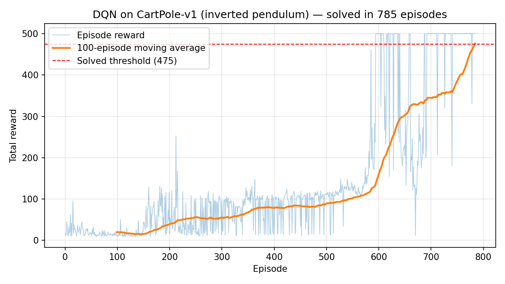

# Deep Q-Network (DQN) — from scratch in NumPy
 
**Mid-term project: Deep Reinforcement Learning for stock-trading optimisation.**
As a validated first step toward a DQN trading agent, this repo solves the classic
**inverted pendulum** control problem (CartPole-v1) with a DQN implemented entirely
from scratch — the Q-network, backpropagation, and the Adam optimiser are all
hand-coded in NumPy. No PyTorch, no TensorFlow.
 
## Results
 
| Metric | Value |
|---|---|
| Solved (avg reward ≥ 475 over 100 episodes) | **episode 785** |
| Final 100-episode average | **476.6** |
| Greedy evaluation on 20 unseen episodes | **500 / 500 on every episode** |
 

 
Early episodes last only 10–30 steps while the agent explores randomly; once the
replay buffer fills and ε decays, performance climbs steeply past the solved
threshold. Continuing training *past* the solved point caused **catastrophic
forgetting** (reward collapsed to ~10) — a documented DQN failure mode we guard
against with best-model snapshotting.
 
## Quick start
 
```bash
pip install numpy gymnasium
 
# train (resumes from dqn_checkpoint.npz if present; optional time budget in seconds)
python dqn_cartpole.py
python dqn_cartpole.py 60        # train for ~60s, checkpoint, resume later
 
# evaluate the saved best model greedily on 20 unseen episodes
python dqn_cartpole.py eval
```
 
Expected eval output with the included `best_model.npz`:
 
```
greedy eval over 20 unseen episodes: mean 500.0 | min 500 | max 500
```
 
To watch the trained agent, create the env with `gym.make("CartPole-v1", render_mode="human")` inside `greedy_eval`.
 
## How it works
 
The agent learns Q(s, a) — the expected discounted return of each action — by
minimising the temporal-difference error against the Bellman target
`y = r + γ · max_a' Q_target(s', a')`. Five standard DQN components, all visible
in `dqn_cartpole.py`:
 
1. **Q-network** — MLP `4 → 128 → 128 → 2` (ReLU, He init), with hand-coded forward pass, backprop, and Adam.
2. **Replay buffer** — 50,000-slot circular buffer; random minibatches of 64 break sample correlation.
3. **Target network** — frozen copy of the online net computes the Bellman target; hard-synced every 250 gradient steps.
4. **ε-greedy exploration** — ε decays 1.0 → 0.01 (×0.995 per episode).
5. **Huber TD loss** — TD error clipped to ±1 for gradient stability.
Two implementation details that matter: episodes cut off by the 500-step time limit
are treated as *truncated*, not terminal (we still bootstrap from the successor
state), and the weights with the best periodic greedy-evaluation score are
snapshotted to `best_model.npz`.
 
## Hyperparameters
 
| Parameter | Value | Parameter | Value |
|---|---|---|---|
| discount γ | 0.99 | replay buffer | 50,000 |
| learning rate (Adam) | 5e-4 | learn start | 1,000 transitions |
| batch size | 64 | target sync | every 250 steps |
| ε start / end / decay | 1.0 / 0.01 / 0.995 | network | 4-128-128-2, ReLU |
 
## Repository contents
 
| File | Description |
|---|---|
| `dqn_cartpole.py` | Complete DQN implementation + training / eval CLI |
| `best_model.npz` | Trained weights (500/500 on unseen episodes) |
| `training_curve.png` | Reward curve of the solving run |
| `rewards_history.npy` | Per-episode rewards (785 episodes) |
| `midterm_report_dqn.pdf` | Full mid-term report (theory, code walkthrough, results) |
 
## Roadmap
 
- [x] DQN from scratch (NumPy): Q-net, backprop, Adam, replay, target net
- [x] Solve the inverted pendulum (CartPole-v1)
- [x] Mid-term report + video
- [ ] Gymnasium-style stock-trading environment (OHLCV + indicators; buy/sell/hold)
- [ ] Train trading agent on historical data; Double DQN
- [ ] Walk-forward backtesting vs buy-and-hold (return, Sharpe, drawdown)
## References
 
- Mnih et al., [*Playing Atari with Deep Reinforcement Learning*](https://arxiv.org/abs/1312.5602), 2013
- Mnih et al., [*Human-level control through deep RL*](https://www.nature.com/articles/nature14236), Nature 2015
- Sutton & Barto, [*Reinforcement Learning: An Introduction*](http://incompleteideas.net/book/the-book-2nd.html), 2nd ed.
- [Gymnasium — CartPole-v1](https://gymnasium.farama.org/environments/classic_control/cart_pole/)
